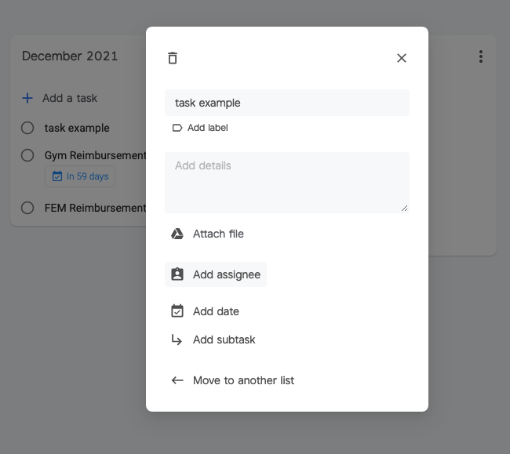
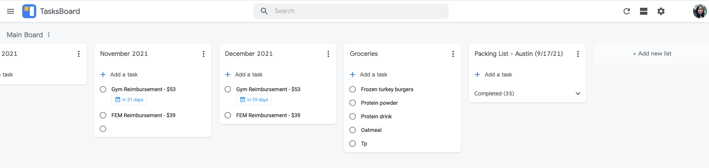
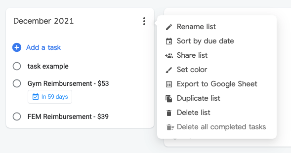

# sporks

## What is Sporks?
Sporks is a simple To-Do app that will eventually grow in complexity to mimic the capabilities of Google TasksBoard/Trello/Jira. Why is it called Sporks? I could make up some metaphor about how sporks are versatile and do two things at once, but I mostly just like how it sounds.
  

## Goals for this project:

The purpose is for me to build a full stack application to learn about and fill in any gaps in my programming knowledge (solidify fundamentals). I would like to use this to apply any new concepts and best practices I learn in order to solidify my understanding in them. I also want to become more proficient in JavaScript and React and strengthen my problem solving skills.

Note: I have gotten stuck in the "planning/designing phase" before so I wanted to reference products that already exist so I don't have to spend too much time deciding how things look or what they do. That way I can get started with coding it out and solving the more interesting problems sooner.
  

### Things I want to incorporate/learn:
- Object Oriented Programming
  - Become more comfortable in fundamentals and implementation
  - Learn  *when* it is best to use OOP vs Functional Programming
  - Understand fundamentals of OOP not only in terms of JavaScript, but if/how it differs from other languages
  
- JavaScript
  - Understand and Implement "the hard parts"
    - scope
    - this
    - promises
    - arrow functions
    - closure
    - asynchronicity
    - callbacks
  - Typescript - incorporate at beginning or do a conversion later
  - React - practice making "dumb" components when necessary and refactoring
  

- TDD (test driven development)
  - Incorporate best practices and build good habits around testing
  - Use Jest or react-testing-library (or maybe there's a better option)
  

- Databases
  - Understand when to use which kind of database
  - Get more practice with schemas and queries
  

- Kafka? Docker? CI/CD? Or any other tools we use at ATG that I could get more familiar with
  

- Node.js
  - just use it, Would like to get more comfortable with some backend things.
  

- CSS
  - Animations and fun stuff upon completing a ticket
  - Flexbox
  - Drag and Drop items into different columns
  - Create a mini component library? Or just use an already existing one.

  

## Features: Rough Planning

v1: MVP, Add items
- Basic CRUD operations (create, read, update, delete) for a to-do item (1 column/list for now)
- Tests in place
- DB schema

v2: Add users
- Basic CRUD operations for a user
- Authentication/Authorization, way to log in

v3: Add detailed items, Mimic Google Tasksboard Features
- Multiple Columns aka Lists (CRUD for columns)
- Items can be dragged and dropped into columns
- Columns can be dragged around and reordered?
- Items can be edited in detail (modal with label, details, assignee, due date, subtasks)

v4: Add Teams, Mimic Trello Features
- Basic CRUD for a team (a team can have multiple users)
- Define teams, add details
- Items have Priority level, due dates

v5: Add Projects, Mimic Jira Features
- Columns now have ToDo, In Progress, In Review, etc
- Details Section (Status, Teams, Labels, Theme)
- People Section (Developer, Reviewer, Assignee)
- Dates Section (when last updated, when due, etc)
- Description (add attachments)
- Activity/Comments

  

## Brainstorming Stretch Feature Ideas
Pomodoro Timer within in each ticket
  - ties in for accurately estimate story points upon review
  - 25 min on, 5 min break, repeat x times, 20 min break, repeat

Item Randomizer
  - Selects from group of items with the same priority and offers a random item to work on

Tagging Others
  - Tag other users, groups, projects, etc.

More Visible Calendar for Sprints/Quarters/Timeframe
- Maybe somewhere on team page

Incorporate an API?
  - https://rapidapi.com/blog/most-popular-api/#category

